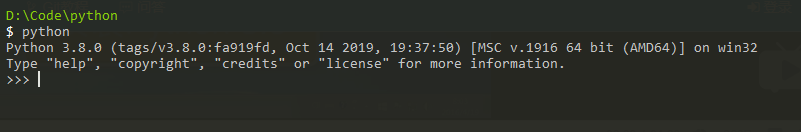

# 安装Python

目前，Python有两个版本，一个是2.x版，一个是3.x版，这两个版本是不兼容的。由于3.x版越来越普及，我们的教程将以最新的Python 3.8版本为基础。请确保你的电脑上安装的Python版本是最新的3.8.x，这样，你才能无痛学习这个教程。

## 在Mac上安装Python
如果你正在使用Mac，系统是OS X>=10.9，那么系统自带的Python版本是2.7。要安装最新的Python 3.8，有两个方法：

方法一：从Python官网下载Python 3.8的[安装程序](https://www.python.org/downloads/)，下载后双击运行并安装；

方法二：如果安装了[Homebrew](https://brew.sh/)，直接通过命令brew install python3安装即可。

## 在Linux上安装Python
如果你正在使用Linux，那我可以假定你有Linux系统管理经验，自行安装Python 3应该没有问题，否则，请换回Windows系统。

对于大量的目前仍在使用Windows的同学，如果短期内没有打算换Mac，就可以继续阅读以下内容。

## 在Windows上安装Python
首先，根据你的Windows版本（64位还是32位）从Python的官方网站下载Python 3.8对应的[64位安装程序](https://www.python.org/ftp/python/3.8.0/python-3.8.0-amd64.exe)或[32位安装程序](https://www.python.org/ftp/python/3.8.0/python-3.8.0.exe)

[安装python的坑，你有绕过吗？](https://www.jianshu.com/p/4bf414fb83e2)

## 运行Python

