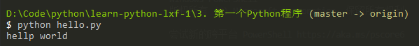

# 使用文本编辑器

## Visual Studio Code!

我们推荐微软出品的Visual Studio Code，它不是那个大块头的Visual Studio，它是一个精简版的迷你Visual Studio，并且，Visual Studio Code可以跨！平！台！Windows、Mac和Linux通用。

请注意，不要用Word和Windows自带的记事本。Word保存的不是纯文本文件，而记事本会自作聪明地在文件开始的地方加上几个特殊字符（UTF-8 BOM），结果会导致程序运行出现莫名其妙的错误。

安装好文本编辑器后，输入以下代码：

print('hello, world')
注意print前面不要有任何空格。然后，选择一个目录，例如C:\work，把文件保存为hello.py，就可以打开命令行窗口，把当前目录切换到hello.py所在目录，就可以运行这个程序了：

也可以保存为别的名字，比如first.py，但是必须要以.py结尾，其他的都不行。此外，文件名只能是英文字母、数字和下划线的组合。

## 直接运行py文件

有同学问，能不能像.exe文件那样直接运行.py文件呢？在Windows上是不行的，但是，在Mac和Linux上是可以的，方法是在.py文件的第一行加上一个特殊的注释：

#!/usr/bin/env python3

print('hello, world')
然后，通过命令给hello.py以执行权限：

$ chmod a+x hello.py
就可以直接运行hello.py了，比如在Mac下运行：

## 小结

用文本编辑器写Python程序，然后保存为后缀为.py的文件，就可以用Python直接运行这个程序了。

Python的交互模式和直接运行.py文件有什么区别呢？

直接输入python进入交互模式，相当于启动了Python解释器，但是等待你一行一行地输入源代码，每输入一行就执行一行。

直接运行.py文件相当于启动了Python解释器，然后一次性把.py文件的源代码给执行了，你是没有机会以交互的方式输入源代码的。

用Python开发程序，完全可以一边在文本编辑器里写代码，一边开一个交互式命令窗口，在写代码的过程中，把部分代码粘到命令行去验证，事半功倍！前提是得有个27'的超大显示器！

