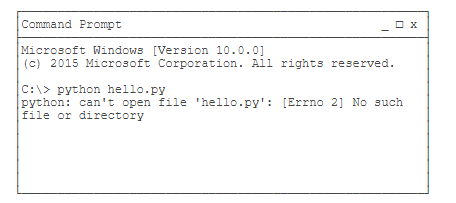

# 第一个Python程序

## Python交互模式

在命令行模式下敲命令python，就看到类似如下的一堆文本输出，然后就进入到Python交互模式，它的提示符是>>>。

在Python交互模式下输入exit()并回车，就退出了Python交互模式，并回到命令行模式：

也可以直接通过开始菜单选择Python (command line)菜单项，直接进入Python交互模式，但是输入exit()后窗口会直接关闭，不会回到命令行模式。

## 命令行模式和Python交互模式

请注意区分命令行模式和Python交互模式。

在命令行模式下，可以执行python进入Python交互式环境，也可以执行python hello.py运行一个.py文件。

执行一个.py文件只能在命令行模式执行。如果敲一个命令python hello.py，看到如下错误：

错误提示No such file or directory说明这个hello.py在当前目录找不到，必须先把当前目录切换到hello.py所在的目录下，才能正常执行。

写一个calc.py的文件，内容如下：

100 + 200 + 300
然后在命令行模式下执行：

C:\work>python calc.py
发现什么输出都没有。

这是正常的。想要输出结果，必须自己用print()打印出来。把calc.py改造一下：

print(100 + 200 + 300)
再执行，就可以看到结果：

最后，Python交互模式的代码是输入一行，执行一行，而命令行模式下直接运行.py文件是一次性执行该文件内的所有代码。可见，Python交互模式主要是为了调试Python代码用的，也便于初学者学习，它不是正式运行Python代码的环境！

